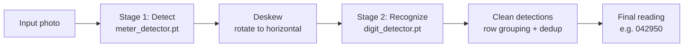

# 💧 Mbarira AI — Water Meter Reading System

**Point your phone at an analog water meter. Get an accurate digit reading back in under a second.**

A two-stage YOLOv8-OBB (oriented bounding box) computer vision pipeline that detects, deskews, and reads mechanical water meter displays — built for Rwanda's water infrastructure, deployed as a live Streamlit app.

[](https://mbarira-watermeter-mode-k83rnsir2syc2twbpm3fts.streamlit.app/)


### 🔗 [**Try the live app →**](https://mbarira-watermeter-mode-k83rnsir2syc2twbpm3fts.streamlit.app/)

---

## Table of Contents

- [Overview](#overview)
- [Key Features](#-key-features)
- [Live Demo](#️-live-demo)
- [How It Works](#-how-it-works)
- [Performance](#-performance)
- [Dataset](#-dataset)
- [Project Structure](#️-project-structure)
- [Tech Stack](#️-tech-stack)
- [Getting Started](#-getting-started)
- [Known Limitations](#️-known-limitations)
- [Roadmap](#️-roadmap)
- [Contributing](#-contributing)
- [License](#-license)
- [Credits](#-credits)

---

## Overview

Reading a mechanical water meter today usually means a technician manually walking to each meter, reading the digit display by eye, and writing it down (or typing it into a phone). That process is slow and introduces transcription errors at scale.

WMRS automates the read: take one photo, and a two-stage vision pipeline detects the meter, finds and straightens the digit window, recognizes each digit, and assembles a clean numeric reading — with confidence scores per digit, and a debug mode that shows exactly what was detected and why any noise was filtered out.

## ✨ Key Features

- 📷 **Two input modes** — upload a photo or capture directly from a phone/webcam camera
- 🎯 **Two-stage detection** — a dedicated model finds the meter and digit window, a second model reads the digits on a tightly cropped, deskewed image
- 📐 **Automatic deskewing** — rotates the digit row to horizontal using the window's own detected angle before reading, instead of reading off a tilted crop
- 🧹 **Geometry-based noise filtering** — drops duplicate/stray detections using row position and confidence, never a hardcoded digit count, so genuine repeated digits (e.g. "00") are always preserved
- 🔍 **Full transparency mode** — an optional debug toggle shows exactly which detections were filtered out and why
- 📊 **Per-digit confidence breakdown** — downloadable as CSV
- 🖥️ **Multi-page in-app site** — Home, Demo, Technology, and Documentation pages built into the app itself

## 🖥️ Live Demo

**[mbarira-watermeter-mode-k83rnsir2syc2twbpm3fts.streamlit.app](https://mbarira-watermeter-mode-k83rnsir2syc2twbpm3fts.streamlit.app/)**

Once there, use the navigation bar at the top to explore:

| Page | What's there |
|---|---|
| **Home** | Project overview, headline stats, quick links |
| **Demo** | Upload or capture a meter photo and get a live reading |
| **Technology** | Full pipeline breakdown, per-stage performance, scope/limitations |
| **Documentation** | Model files, dataset details, per-class metrics, known limitations |

## 🧠 How It Works



1. **Detect** — `meter_detector.pt` (YOLOv8-OBB) locates the meter body and the digit display window in the full photo.
2. **Deskew** — the window's own detected rotation (`cv2.minAreaRect`) straightens the digit row to horizontal before cropping, instead of reading off a tilted image.
3. **Recognize** — `digit_detector.pt` (YOLOv8-OBB) re-detects each digit on the deskewed, upscaled crop — a tighter, cleaner input than the full photo.
4. **Clean** — detections are grouped into rows by position, duplicate boxes competing for the same physical slot are resolved by confidence, and survivors are sorted left-to-right. No fixed digit count is ever assumed.
5. **Read** — the surviving digits are assembled into the final reading, with per-digit confidence scores.

## 📊 Performance

Measured on a held-out test split.

**Stage 1 — full-photo detector**

| Class | mAP50 | mAP50-95 |
|---|---|---|
| meter | 0.995 | 0.917 |
| window | 0.985 | 0.802 |
| digits (avg 0–9) | 0.928 | 0.723 |
| u (unclear) | 0.767 | 0.545 |

**Stage 2 — cropped digit detector**

| Class | mAP50 | mAP50-95 |
|---|---|---|
| digits (avg 0–9) | 0.971 | 0.738 |
| u (unclear) | 0.641 | 0.422 |

Full per-class tables are on the [Documentation page](https://mbarira-watermeter-mode-k83rnsir2syc2twbpm3fts.streamlit.app/) of the live app. Stage 2 improves average digit accuracy by roughly +9 points over Stage 1 alone, but the `u` (unclear) class regresses on the crop — likely crop clipping or augmentation effects on this rare class.

## 📁 Dataset

510 labeled water meter images, split 70 / 20 / 10 (train / val / test), with 13-class OBB annotations: `meter`, `window`, digits `0`–`9`, and `u` (unclear — a digit the model detects but can't confidently classify).

## 🗂️ Project Structure

Mbarira-Watermeter-model/
├── app.py # Full Streamlit app: Home, Demo, Technology, Documentation
├── requirements.txt
├── .streamlit/
│ └── config.toml # Theme
└── models/
├── meter_detector.pt # Stage 1 -- meter + digit window (OBB)
└── digit_detector.pt # Stage 2 -- individual digits (OBB)


## ⚙️ Tech Stack

| Layer | Tools |
|---|---|
| Detection models | YOLOv8-OBB (Ultralytics) |
| App framework | Streamlit (`st.navigation` / `st.Page` multipage) |
| Image processing | OpenCV, Pillow, NumPy |
| Data handling | Pandas |
| Training environment | Google Colab |

## 🚀 Getting Started

```bash
git clone https://github.com/<your-username>/Mbarira-Watermeter-model.git
cd Mbarira-Watermeter-model
pip install -r requirements.txt
streamlit run app.py
```

The app expects the two trained weight files at `models/meter_detector.pt` and `models/digit_detector.pt` (already committed in this repo).

## ⚠️ Known Limitations

- The `u` (unclear) class has the weakest accuracy of any class in both stages — expect occasional false "unclear" flags on worn or faded meter windows.
- Deskewing corrects in-plane rotation (a tilted photo), not full perspective distortion or a genuinely upside-down (~180°) photo.
- Reading accuracy depends on lighting and camera angle; straight-on, well-lit photos of the digit window perform best.
- Trained on 510 images total — a solid start for this meter type/region, but accuracy will vary on brands or conditions not well represented in training.

## 🛣️ Roadmap

- [ ] Public inference API endpoint
- [ ] Perspective (homography) correction for angled photos
- [ ] Expanded training set across more meter brands/conditions
- [ ] Offline/mobile-optimized model export

## 🤝 Contributing

Issues and pull requests are welcome. If you're reporting a misread, including the original photo and the app's debug view (toggle "Show filtered-out detections") helps a lot in diagnosing whether it's a detection, filtering, or classification issue.

## 📄 License

MIT

## 🙏 Credits

Mbarira AI Research Lab — precision computer vision for Rwanda water infrastructure.
